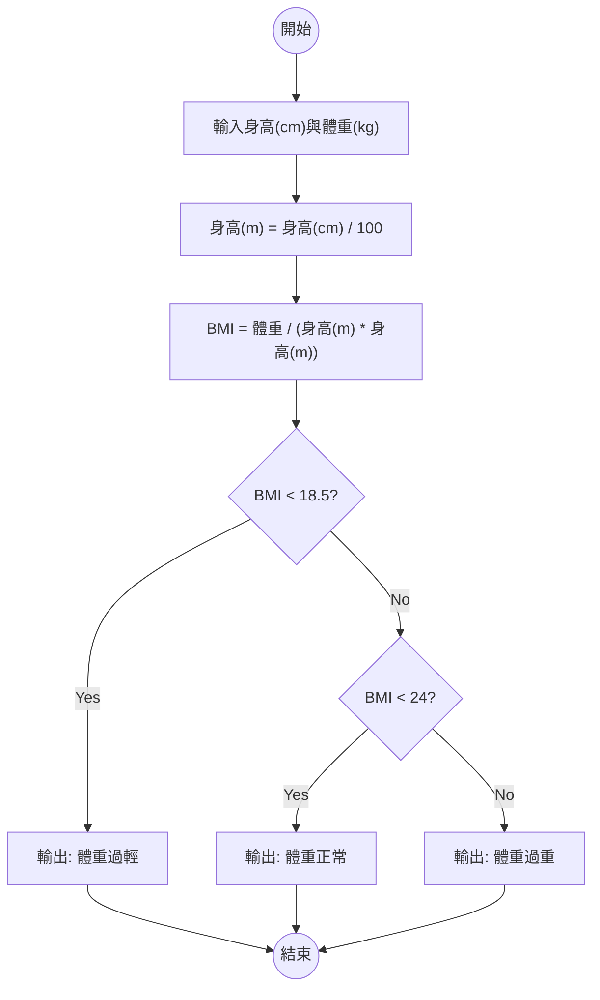
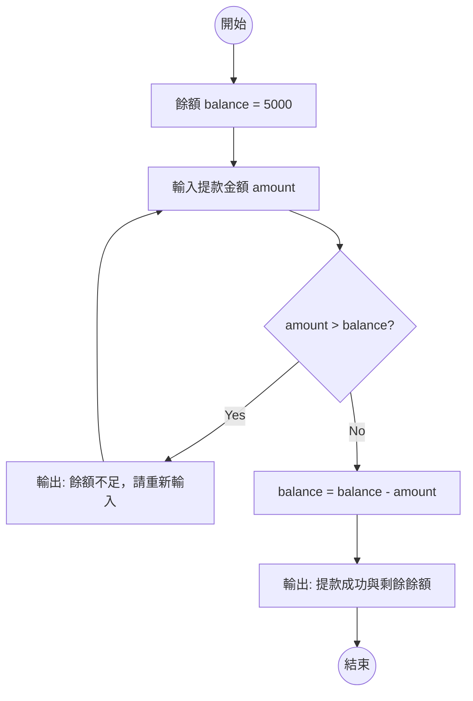
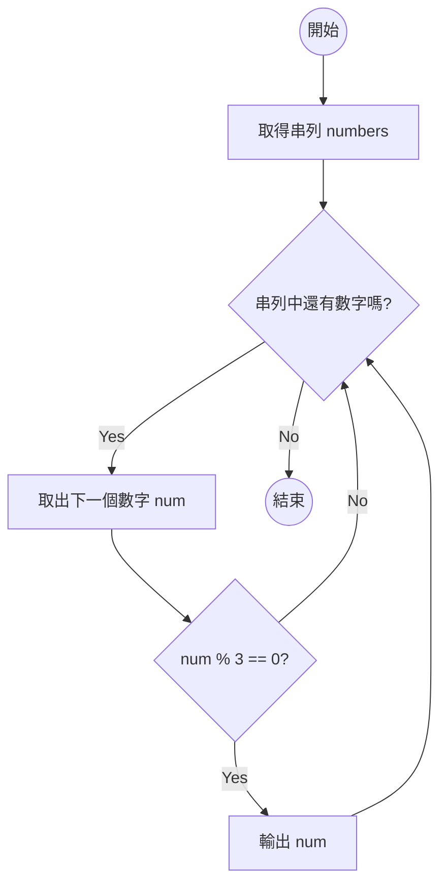

# 課後作業：Python 程式設計與流程圖實作
- 設計 3 題結合「流程圖」與「Python 實作」的課後作業！
- 這份作業的難度由淺入深，涵蓋了**條件判斷**、**迴圈控制**以及**串列走訪**。
- 整理成了「題目描述」與「教師參考解答」的形式，您在發放給學生時，只需將解答部分刪除即可。
## 作業一：BMI 體位計算機 (條件判斷練習)
**【題目描述】**
請設計一個程式，讓使用者輸入身高（公分）與體重（公斤），程式需計算出 BMI 值，並根據以下標準判斷體位：
- BMI < 18.5：體重過輕
- 18.5 <= BMI < 24：體重正常
- BMI >= 24：體重過重
*(提示：BMI 公式為 `體重(公斤) / 身高(公尺)的平方`，記得將公分換算成公尺喔！)*

**【任務要求】**
1. 畫出此程式的 Mermaid 流程圖。
2. 撰寫對應的 Python 程式碼。

<details>
<summary><b>👨‍🏫 教師參考解答 (點擊展開)</b></summary>

**Mermaid 流程圖：**


**Python 程式碼：**
```python
height_cm = float(input("請輸入身高(公分): "))
weight = float(input("請輸入體重(公斤): "))

height_m = height_cm / 100
bmi = weight / (height_m * height_m)
print(f"您的 BMI 為: {bmi:.2f}")

if bmi < 18.5:
    print("體位狀態: 體重過輕")
elif bmi < 24:
    print("體位狀態: 體重正常")
else:
    print("體位狀態: 體重過重")
```
</details>

---

## 作業二：簡易 ATM 提款機 (迴圈與判斷綜合練習)
**【題目描述】**
假設你的銀行帳戶初始餘額為 5000 元。請設計一個提款程式，不斷詢問使用者要提款多少錢：
- 如果提款金額 **大於** 餘額，顯示「餘額不足，請重新輸入」。
- 如果提款金額 **小於或等於** 餘額，則扣除該金額，顯示「提款成功」與「剩餘餘額」，並結束程式。

**【任務要求】**
1. 畫出此程式的 Mermaid 流程圖 (必須包含迴圈結構)。
2. 撰寫對應的 Python 程式碼。

<details>
<summary><b>👨‍🏫 教師參考解答 (點擊展開)</b></summary>

**Mermaid 流程圖：**


**Python 程式碼：**
```python
balance = 5000

while True:
    amount = int(input("請輸入提款金額: "))

    if amount > balance:
        print("餘額不足，請重新輸入！")
    else:
        balance = balance - amount
        print("提款成功！")
        print(f"您的剩餘餘額為: {balance} 元")
        break  # 提款成功，離開迴圈
```
</details>

---

## 作業三：尋找幸運數字 (串列走訪練習)
**【題目描述】**
給定一個數字串列 `numbers = [12, 5, 9, 20, 33, 8, 15]`。請設計一個程式，逐一檢查串列中的每個數字，如果該數字是 **3 的倍數**，就把它印出來。

**【任務要求】**
1. 畫出此程式的 Mermaid 流程圖。
2. 撰寫對應的 Python 程式碼。

<details>
<summary><b>👨‍🏫 教師參考解答 (點擊展開)</b></summary>

**Mermaid 流程圖：**


**Python 程式碼：**
```python
numbers = [12, 5, 9, 20, 33, 8, 15]

print("3 的倍數有：")
for num in numbers:
    if num % 3 == 0:
        print(num)
```
</details>

---
