# Python 程式設計與邏輯思維
## 使用 Mermaid 繪製程式流程圖
- **授課教師：** [Y.H Wen/PhD of NTU Physics]
- **適用對象：** 高中資訊科技課程 (中等程度)
- 採用了**「先看流程圖，下一張看程式碼」**的編排方式
- 與 Python 程式碼整合，緊跟在對應的流程圖之後。
---

# 課程大綱 (Agenda)

1. 什麼是流程圖與 Mermaid？
2. Mermaid 流程圖基礎語法介紹
3. 日常生活邏輯範例 (3個)
4. 基礎數學與判斷範例 (含 Python 實作)
5. 經典演算法範例 (含 Python 實作)
6. 生活化串列與進階範例 (5個)
7. 總結與 Q&A

---

# 1. 什麼是流程圖與 Mermaid？

- **流程圖 (Flowchart)**：用圖形來表示演算法或工作流程，幫助我們在寫程式前釐清邏輯。
- **Mermaid**：一種基於 JavaScript 的圖表繪製工具，讓我們可以用「純文字」來產生流程圖。
- **優點**：不需要手動拉圖形、排版，只要專注於邏輯與文字描述，支援 Markdown，非常適合程式設計師！
- Mermaid線上編輯器: https://www.processon.io/zh-tw/mermaid
- 互動式 Mermaid 流程圖教學 https://www.csie.ntu.edu.tw/~d95015/mermaid.html

---

# 2. Mermaid 基礎語法：方向與節點

使用 `graph` 或 `flowchart` 宣告，並指定方向：
- `TD` 或 `TB`：由上到下 (Top to Down)
- `LR`：由左到右 (Left to Right)

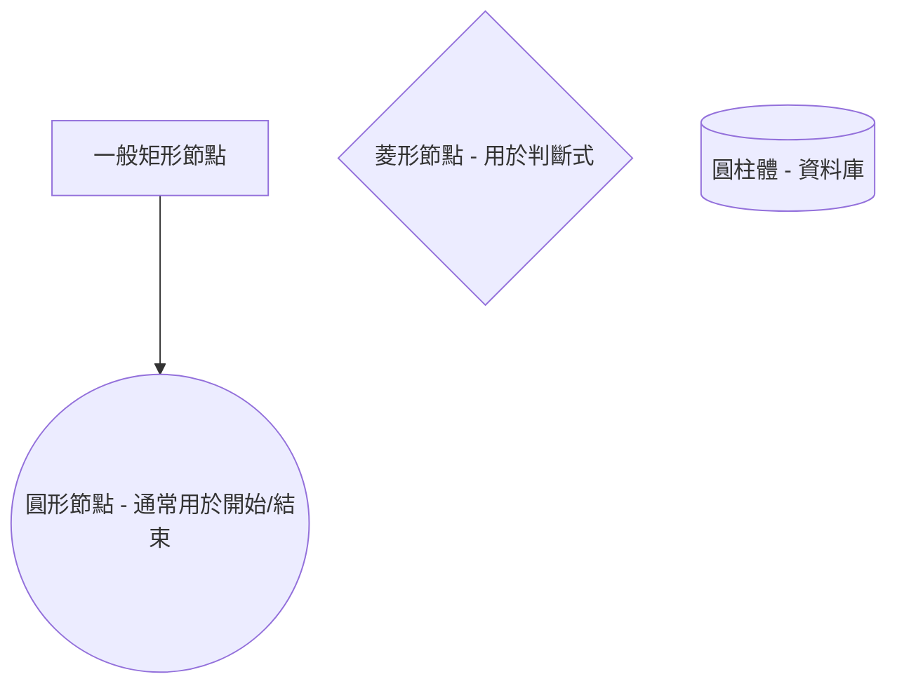

---

# 2. Mermaid 基礎語法：線條與文字

可以透過不同的箭頭連接節點，並在線上加上文字說明。

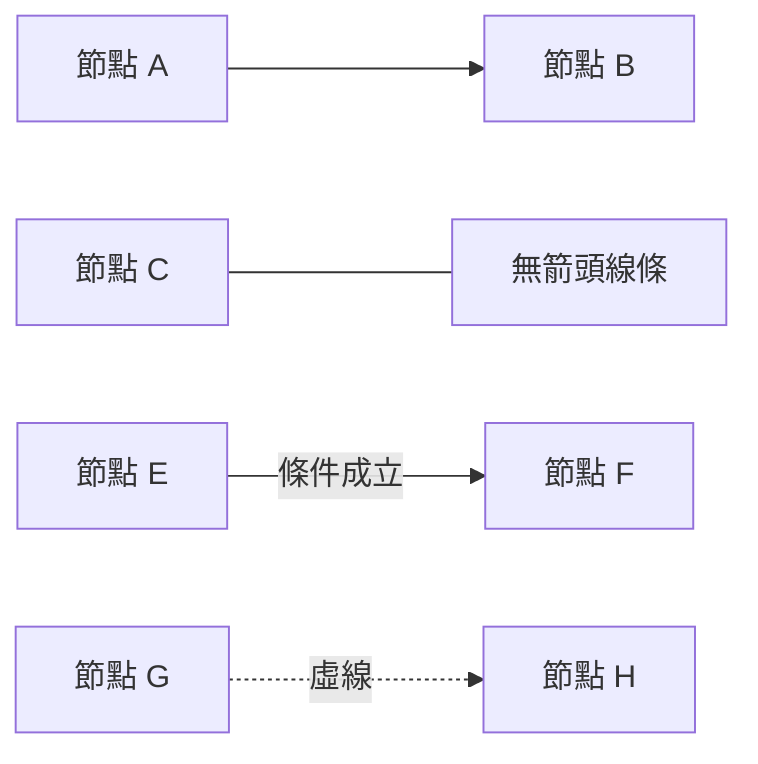

---

# 2. Mermaid 基礎語法：判斷與迴圈結構

在程式設計中，最常使用**菱形**來表示 `if/else` 判斷或 `while/for` 迴圈的條件。

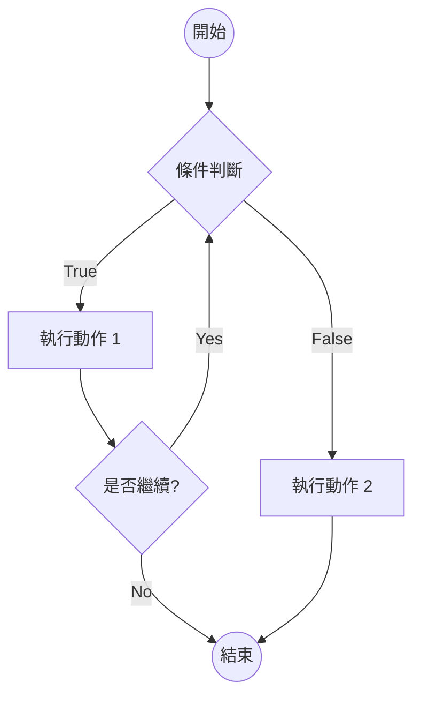

---

# 範例 1：日常生活 - 早上起床上學
**包含判斷與迴圈**

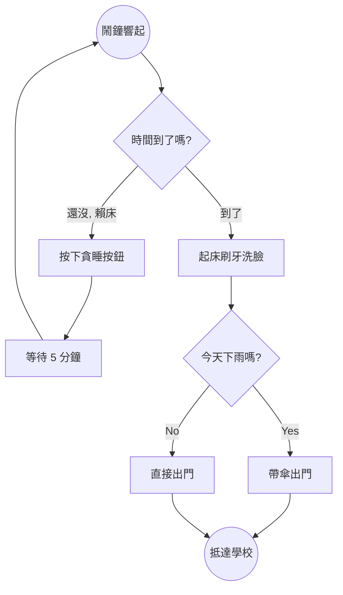

---

# 範例 2：日常生活 - 自動販賣機買飲料
**包含判斷與迴圈**

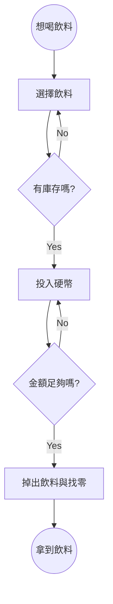

---

# 範例 3：日常生活 - 準備段考
**包含判斷與迴圈**

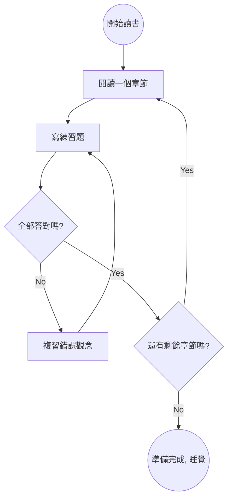

---

# 範例 4：基礎數學 - 計算 1+2+...+100
**使用迴圈累加 (流程圖)**

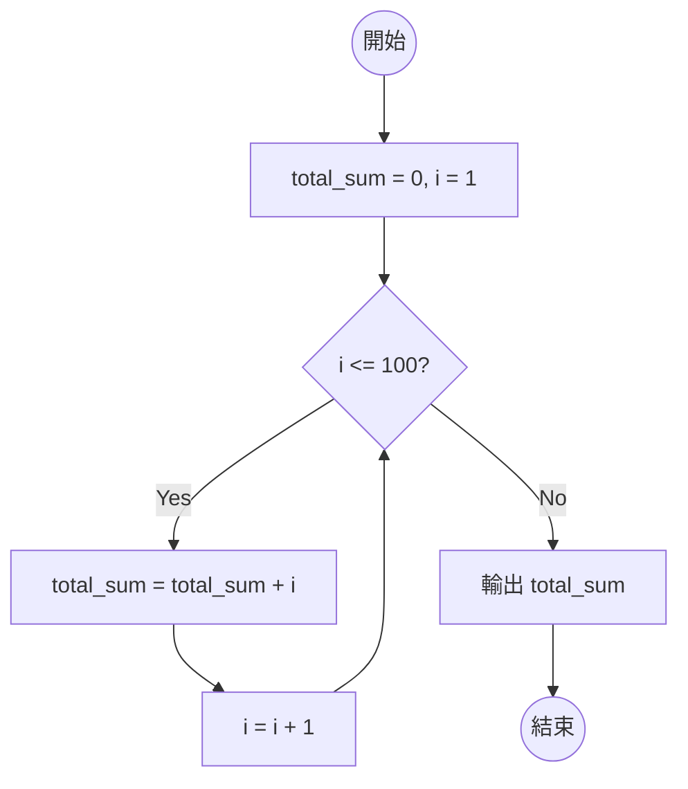

---

# 範例 4：基礎數學 - 計算 1+2+...+100
**Python 程式碼實作**

```python
# 1. 初始化變數
total_sum = 0
i = 1

# 2. 條件判斷與迴圈
while i <= 100:
    # 條件成立 (Yes) 時執行的動作
    total_sum = total_sum + i  # 累加目前的數字
    i = i + 1                  # 數字加 1，準備下一次迴圈

# 3. 條件不成立 (No) 時，離開迴圈並輸出結果
print("1 加到 100 的總和為:", total_sum)
```

---

# 範例 5：基礎數學 - 判斷奇偶數 (Odd or Even)
**使用條件判斷與 Modulo (%)**

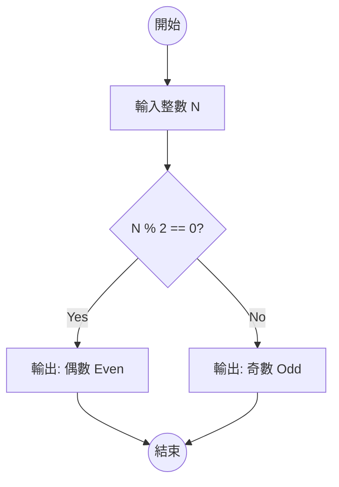

---

# 範例 6：基礎數學 - 成績等第判斷
**多重條件判斷 (if-elif-else)**

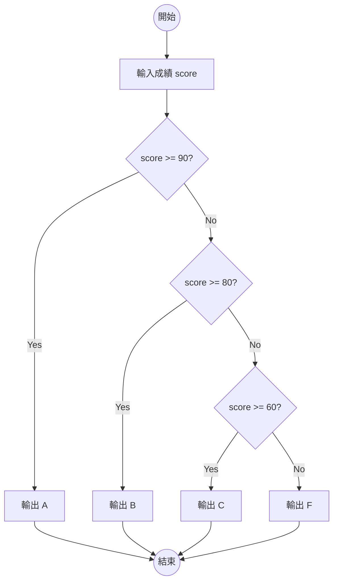

---

# 概念補充：什麼是「輾轉相除法」？
**用來尋找兩個數字的最大公因數 (GCD)**

- **核心邏輯**：大數除以小數，取「餘數」。接著用原本的「小數」再除以剛剛的「餘數」，不斷重複，直到**餘數為 0**，此時的除數就是 GCD。
- **實際推演：找 48 與 18 的 GCD**
  1. 48 ÷ 18 = 2 ... **餘 12**  (a=48, b=18, 餘數=12)
  2. 18 ÷ 12 = 1 ... **餘 6**   (a=18, b=12, 餘數=6)
  3. 12 ÷ 6 = 2 ... **餘 0**    (a=12, b=6, 餘數=0)
  4. **餘數為 0，結束！最大公因數為 6。**

---

# 範例 7：經典演算法 - 最大公因數 (GCD)
**輾轉相除法 (Euclidean Algorithm) 流程圖**

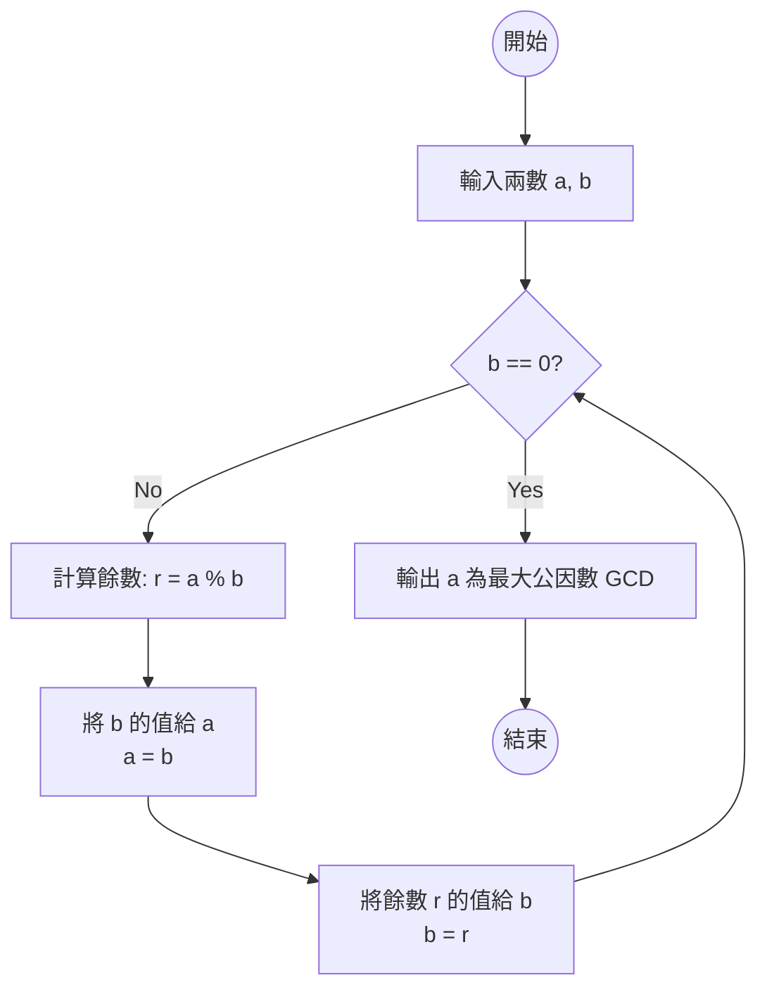

---

# 範例 7：經典演算法 - 最大公因數 (GCD)
**Python 程式碼實作**

```python
# 1. 取得使用者輸入
a = int(input("請輸入第一個數字 a: "))
b = int(input("請輸入第二個數字 b: "))

# 2. 輾轉相除法迴圈
while b != 0:
    r = a % b  # 計算餘數
    a = b      # 將 b 的值給 a
    b = r      # 將餘數給 b

# 3. 迴圈結束，輸出結果
print("最大公因數 (GCD) 為:", a)
```

---

# 範例 8：經典演算法 - 最小公倍數 (LCM)
**利用公式：兩數相乘 = GCD × LCM (流程圖)**

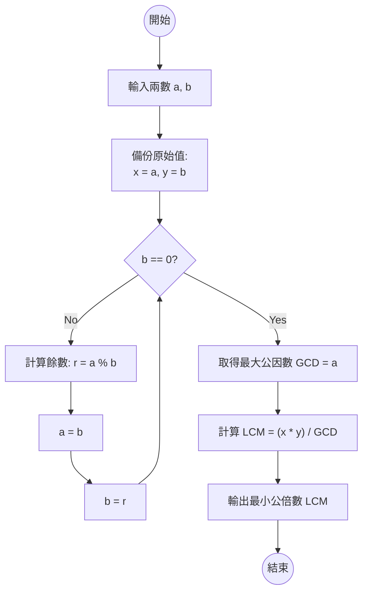

---

# 範例 8：經典演算法 - 最小公倍數 (LCM)
**Python 程式碼實作**

```python
a = int(input("請輸入第一個數字 a: "))
b = int(input("請輸入第二個數字 b: "))

# 備份原始數值，因為 a 和 b 在迴圈中會改變
x = a
y = b

# 輾轉相除法求 GCD
while b != 0:
    r = a % b
    a = b
    b = r
gcd = a

# 計算最小公倍數 (使用 // 確保結果為整數)
lcm = (x * y) // gcd
print(f"{x} 與 {y} 的最小公倍數為: {lcm}")
```

---

# 範例 9：經典演算法 - 質數判斷 (Prime Number)
**檢查是否有 1 和自己以外的因數**

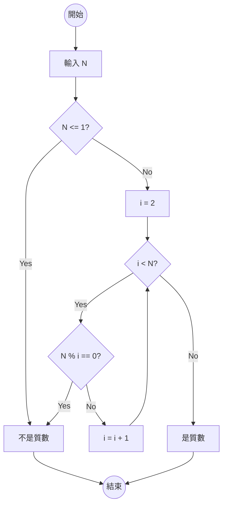

---

# 範例 10：經典演算法 - 閏年判斷 (Leap Year)
**四年一閏，百年不閏，四百年再閏 (流程圖)**

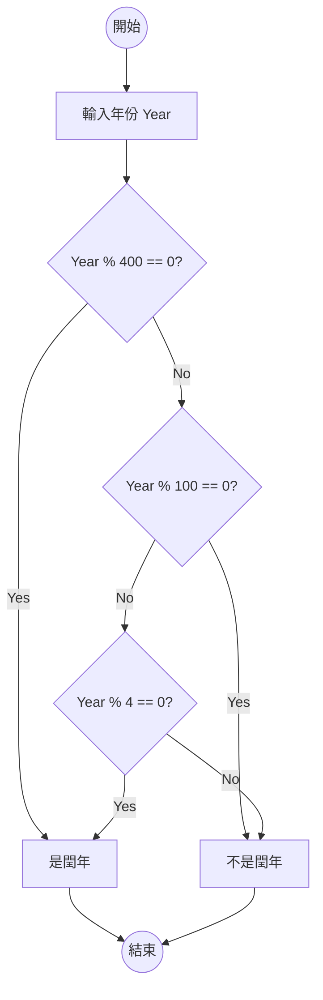

---

# 範例 10：經典演算法 - 閏年判斷 (Leap Year)
**Python 程式碼實作**

```python
# 1. 取得使用者輸入
year = int(input("請輸入要判斷的年份: "))

# 2. 依照流程圖的順序進行多重條件判斷
if year % 400 == 0:
    print(year, "是閏年 (四百年再閏)")

elif year % 100 == 0:
    print(year, "不是閏年 (百年不閏)")

elif year % 4 == 0:
    print(year, "是閏年 (四年一閏)")

else:
    print(year, "不是閏年")
```

---

# 範例 11：進階範例 - 猜數字遊戲
**結合迴圈與大小判斷**

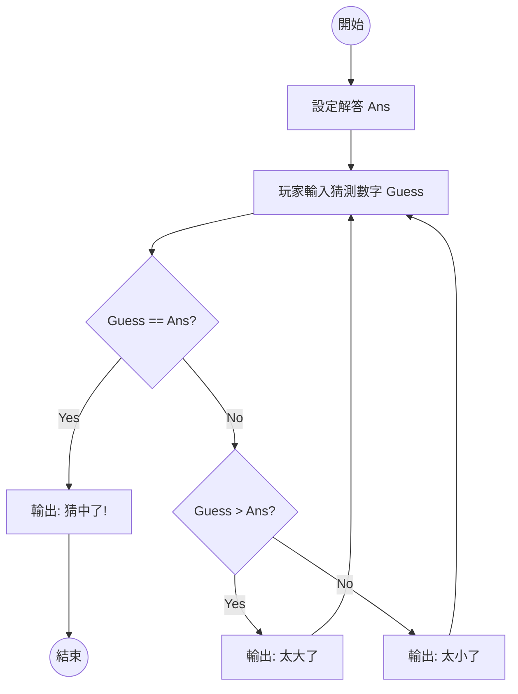

---

# 範例 12：生活化串列 - 購物車結帳計算
**走訪串列累加金額，滿千打九折**

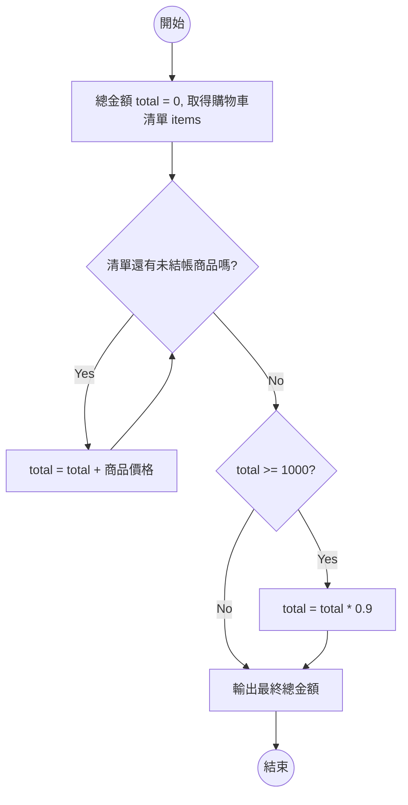

---

# 範例 13：生活化串列 - 找出班級最高分
**走訪串列尋找最大值 (Max)**

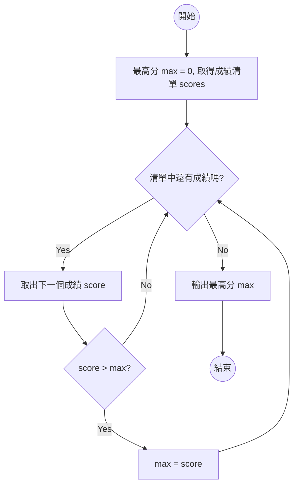

---

# 範例 14：生活化串列 - 篩選及格名單
**條件過濾與新增資料到新串列 (Append)**

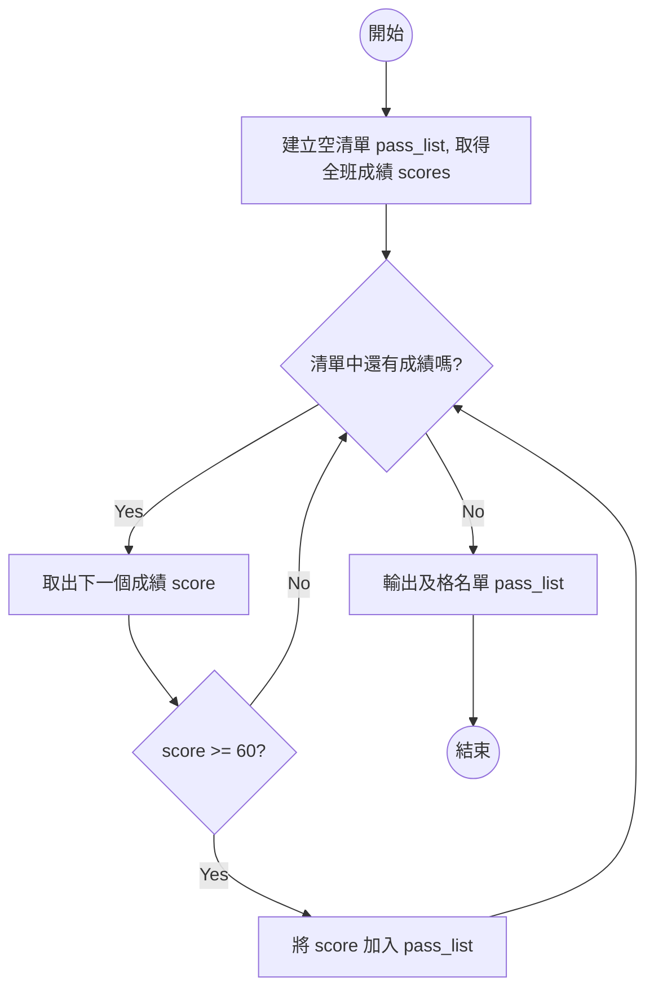

---

# 範例 15：進階範例 - 密碼強度驗證
**多條件綜合檢查 (長度、大寫、數字)**

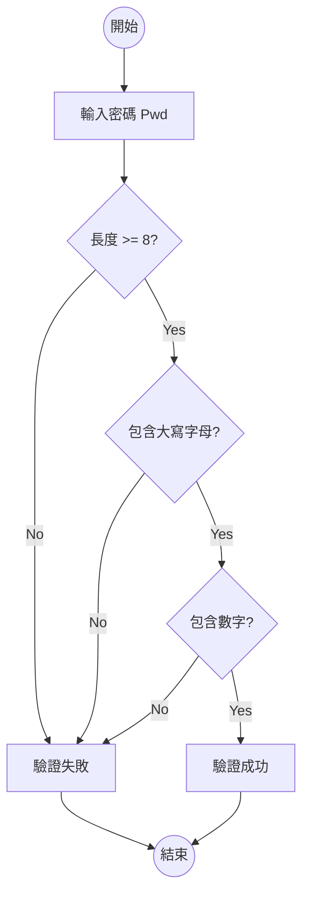

---

# 總結

1. **流程圖是寫程式的藍圖**：先畫圖釐清邏輯，再動手寫 Python 程式碼，能大幅減少 Bug。
2. **Mermaid 語法簡單**：只要掌握 `graph TD`、節點形狀 `[]` `()` `{}` 以及箭頭 `-->`，就能畫出 90% 的流程圖。
3. **Mermaid 語法可以直接給AI看**：Vibe coding。
4. **三大控制結構**：
   - **循序** (箭頭直線往下)
   - **選擇/判斷** (菱形節點分岔)
   - **重複/迴圈** (箭頭指回上方的節點)

---

# Q & A 時間

- 參考資料：
  - [Mermaid 官方文件 - Flowcharts](https://mermaid.ai/open-source/syntax/flowchart.html)
  - [HackMD Mermaid 教學](https://hackmd.io/@docs/mermaid_graphTD)
  - Mermaid線上編輯器: https://www.processon.io/zh-tw/mermaid
  - 互動式 Mermaid 流程圖教學 https://www.csie.ntu.edu.tw/~d95015/mermaid.html

**大家有什麼問題嗎？**
